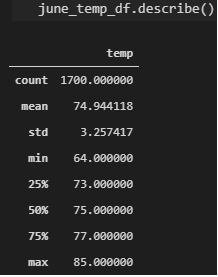
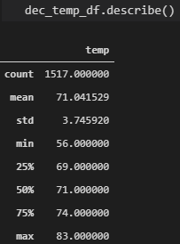

# surfs_up

# Overview of Analysis
The client had requested for analysis on his data containing Hawaii weather information in SQLITE format. The analysis uses Flask and SQLAlchemy and provides the a summary of all the temperatures observed on the months of June and December.

# Results
Description statistics of measured temperature (°F) in Hawaii
|June|December|
|---|---|
|||

Key observable differences:
- December is on average, colder than June by 3.86 °F
- December 

