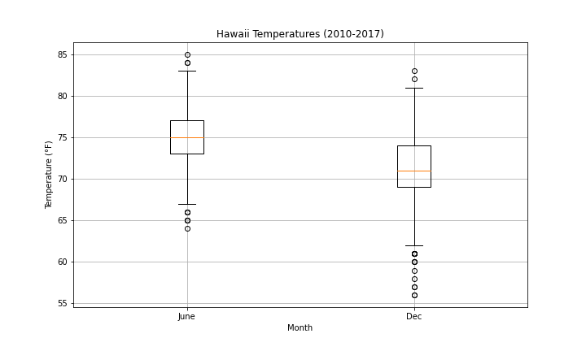

# surfs_up

# Overview of Analysis
The client had requested for analysis on his data containing Hawaii weather information in SQLITE format. The analysis uses Flask and SQLAlchemy and provides the a summary of all the temperatures observed on the months of June and December.

# Results
Description statistics of measured temperature (°F) in Hawaii
|June|December|BoxPlot|
|---|---|---|
||||

Key observable differences:
- December is on average, colder than June by 3.86 °F
- December has a greater spread with more outliers, despite having fewer data points
- The maximum temperatures observed are relatively small (difference of 2°F) in contrast to the difference observed in minimum temperatures (8°F)

# Summary
- It's almost a good time to surf! Even in December, the first quartile of temperatures are still suitable for surfing and vacation
- Additional queries recommended:
  - Determine the coordinates of measuring station and combine the coordinates with google maps API to start segregating geographical zones
  - Obtain percipaition breakdowns by month and geographical region as well

